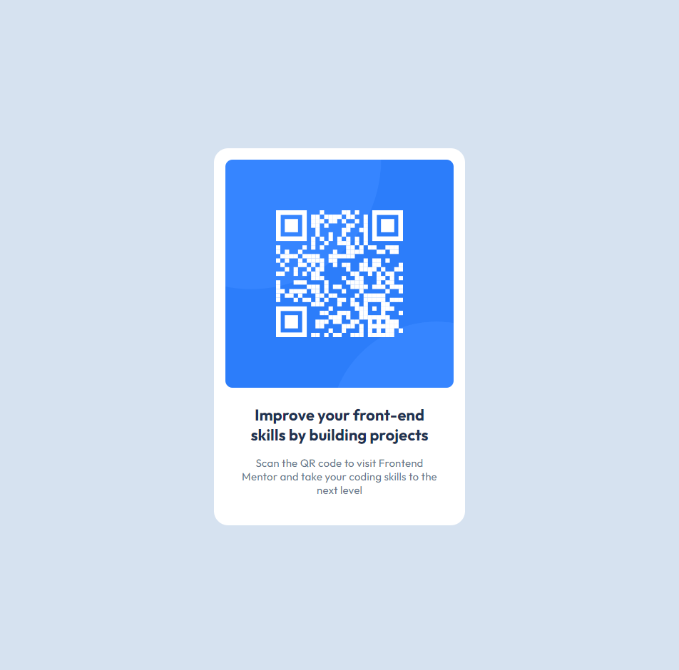

# Frontend Mentor - OR code component solution

This is a solution to the [QR code component challenge on Frontend Mentor](https://www.frontendmentor.io/challenges/qr-code-component-iux_sIO_H)

## Table of contents

- [Overview](#overview)
  - [Screenshot](#screenshot)
  - [Links](#links)
- [My process](#my-process)
  - [Built with](#built-with)
  - [What I learned](#what-i-learned)
  - [Continued development](#continued-development)
- [Author](#author)

## Overview

A qr code component webpage resembling the one provided in the preview for the challenge from frontendmentor.io

### Screenshot



### Links

- Live Site URL: https://veena-k-venugopal.github.io/fm-qr-code-component/

## My process

I started by creating separate divs to place the text and the image. After that I set up the appropriate background colors, margins, and paddings. Image was the one of the last things I started on since I knew I needed more research in getting the right alignment for the image correctly. I found using flexbox display to be immensely helpful. I was able to easily get the image and the text divs situated through flexbox.

### Built with

- Semantic HTML5 markup
- CSS custom properties
- Flexbox

### What I learned

The  element is inline. Change its display property to block to help achieve the desired alignment

```css
.image img {
  width: 100%;
  height: auto;
  display: block;
  border-radius: 10px;
}
```

To get the main content div centered horizontally and vertically

```css
body {
  background-color: hsl(212, 45%, 89%);
  display: flex;
  justify-content: center;
  align-items: center;
  height: 100vh;
}
```

### Continued development

I was able to dive more into using flexbox during this challenge. I want to learn even more as it clearly makes it easier for mobile-first development layouts.

## Author

- Frontend Mentor - Veena-K-Venugopal (https://www.frontendmentor.io/profile/Veena-K-Venugopal)
